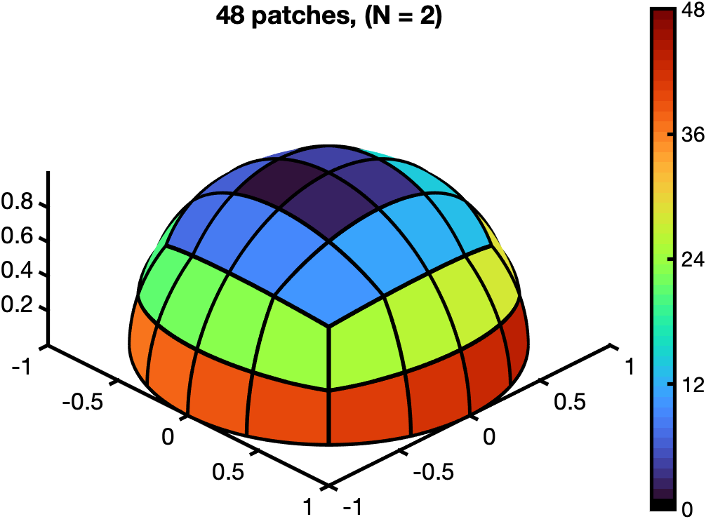

# 3D-SWIG

A simple method for improved k-space uniformity after ECG-binning in Kooshball (3D-radial) MRI sampling

<picture>
  <source media="(prefers-color-scheme: dark)" srcset="figures/sphere_48_dark.png">
  <source media="(prefers-color-scheme: light)" srcset="figures/sphere_48.png">
  
</picture>

